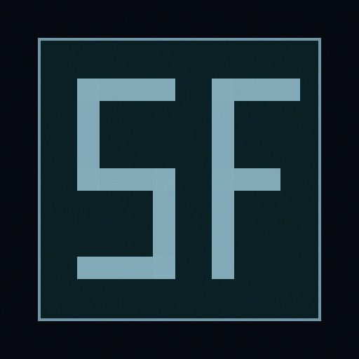

<p align="center">
  
</p>

<h1 align="center">StudioFlow Workflow</h1>

<p align="center">
  Kinetic design-engineering loop for high-signal shipping teams.
</p>

<p align="center">
  <a href="https://becktothefuture.github.io/studioflow/"><strong>Launch Live Microsite</strong></a>
  ·
  <a href="#proof"><strong>Proof</strong></a>
  ·
  <a href="#workflow"><strong>Workflow</strong></a>
  ·
  <a href="#docs"><strong>Docs</strong></a>
  ·
  <a href="studioflow-project/"><strong>Repo</strong></a>
</p>


<details>
<summary>Divider fallback (static PNG)</summary>


</details>

## Live Site

**Microsite URL:** [https://becktothefuture.github.io/studioflow/](https://becktothefuture.github.io/studioflow/)

## Hero

StudioFlow keeps design signal coherent from canvas intent to merged code.

```bash
cd studioflow-project
npm run loop:run
```

## Context Strip

### Why this exists
Design drift appears fast in high-velocity teams. StudioFlow makes each loop measurable and reviewable.

### Compatibility matrix

| Capability | Status |
| --- | --- |
| Code to Canvas | `LIVE` |
| Canvas Verification | `LIVE` |
| Canvas to Code | `LIVE` |
| Proof Manifest | `LIVE` |

## What It Offers

| Capability | Outcome |
| --- | --- |
| Semantic handoff payloads | Agents operate with dense, predictable inputs. |
| Stable sfid anchors | Meaningful nodes preserve identity through redesign rounds. |
| Token-only surfaces | Brand control stays centralized in canonical variables. |
| Manifest lineage | Evidence stays attached to every run in version control. |
| Multi-agent protocol | Claude, Codex, and editor agents share one operating contract. |
| Breakpoint fidelity | Mode values stay aligned through one schema. |
| Fast quality gates | Risk appears early in active implementation cycles. |
| Brand velocity | Visual expression moves quickly with structural confidence. |

## Workflow

| Step | Command | Result |
| --- | --- | --- |
| `01` | `npm run loop:code-to-canvas` | Build canvas handoff payloads. |
| `02` | `npm run loop:verify-canvas` | Validate contract shape, token usage, and sfid coverage. |
| `03` | `npm run loop:canvas-to-code` | Apply approved updates into source files. |
| `04` | `npm run check && npm run build && npm run manifest:update` | Lock release quality and refresh manifest evidence. |

## Agent Support

| Agent | Operational note |
| --- | --- |
| Claude Code | Use `studioflow-project/CLAUDE.md` plus `.claude/commands/*` playbooks. |
| OpenAI Codex | Keep run policy in `AGENTS.md`. |
| Cursor | Keep guardrails in project rules. |
| GitHub Copilot | Mirror gate expectations in repo instructions. |

## Use Cases

- Coding agents shipping dense UI updates.
- Design systems coordinating multi-breakpoint token changes.
- Product squads shipping fast with audit-ready proof.

## Adoption Tiers

| Tier | Profile | Scope |
| --- | --- | --- |
| Local Loop | Solo or pair implementation | Local loop commands, proof strip, token + sfid checks |
| Team Flow | Cross-functional squads | Shared contracts and review-ready manifest lineage |
| Enterprise Workflow | Platform governance | Policy gates, snapshot archives, multi-repo rollout patterns |

## FAQ

### How are IDs kept stable?
Stable sfids are verified against manifest expectations and snapshot state.

### Where does proof live?
Proof artifacts live in snapshots, manifest metadata, and run outputs.

### How does this fit CI?
Use the same loop commands in pipeline jobs and gate merges on pass state.

## Start in 60 Seconds

```bash
cd studioflow-project
npm run setup:project
npm run setup:claude
npm run check:mcp
```

## Proof

| Signal | Value |
| --- | --- |
| Last Verification | `npm run check` |
| Stable sfid Count | `8` |
| Manifest | `studioflow-project/studioflow.manifest.json` |

## Docs

- `studioflow-project/docs/STUDIOFLOW_WORKFLOW.md`
- `studioflow-project/docs/CANVAS_EXCHANGE_CONTRACT.md`
- `studioflow-project/docs/FIGMA_EXCHANGE_CONTRACT.md`
- `studioflow-project/docs/CLAUDE_CODE_SETUP.md`
- `studioflow-project/docs/DEMO_WEBSITE_ROUNDTRIP.md`
- `studioflow-project/CLAUDE.md`
- `studioflow-project/.claude/commands/README.md`
