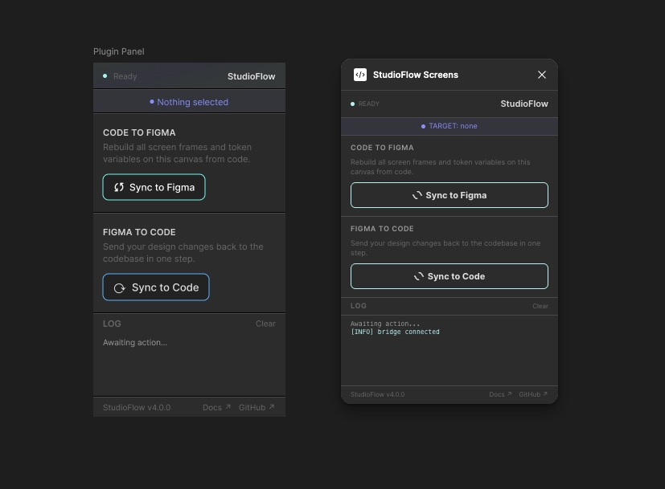

# PRD: Figma–Cursor Middle Layer

**Status:** Draft  
**Last updated:** 2026-02-22  
**Source plan:** `docs/DESIGN_SYSTEM_AND_FIGMA_SYNC.md` (Improvements 1–13)

---

## 1. Introduction / Overview

The “middle layer” between Figma and Cursor is the set of artifacts and workflows that keep design (Figma) and code (Cursor/codebase) aligned: token source, conduit payload (code-to-canvas), Conduit MCP / Figma plugin behaviour, and verification. Today this layer is partially implemented; gaps cause ambiguity (e.g. which tokens are variable-bound vs resolved, no coverage report, no style layer in the conduit). This PRD turns the 13 refinements from the design system doc into an actionable, verifiable plan so the middle layer is deterministic, auditable, and easy to operate from Cursor and from Figma.

**Problem:** Designers and agents cannot reliably know what will sync, what failed, or how to fix sync errors. The conduit file and plugin do not expose a style layer or element–property mapping; verification does not flag “could be styles.”

---

## 2. Goals

- **Single source of truth** for design system standard (spacing, typography, colours, breakpoints) and for code↔Figma token mapping.
- **Observable middle layer:** Coverage report (Phase 1), verification log with bound/unbound and “could be styles” (Phase 3), and a clear error taxonomy with recovery hints.
- **Deterministic, diff-friendly conduit:** Schema/versioning, stable ordering, and one MCP-friendly entry point (“generate conduit from code”).
- **Style layer in conduit:** Semantic styles (Card, Button, Text/Body) and special styles (e.g. gradient) defined in the conduit with element–property→token/style mapping so Figma and Cursor agree on what gets applied.

---

## 3. User Stories

### US-001: Design system standard document

**Description:** As a **design system maintainer**, I want a single canonical document that defines the design system standard (8+2 spacing, typography scale, colour roles, radii, motion, four breakpoints) so that Cursor, the plugin, and humans all reference the same spec.

**Acceptance Criteria:**

- [ ] New file `docs/DESIGN_SYSTEM_STANDARD.md` exists and defines: spacing scale (8 base + 2 micro with names), typography scale (sizes, weights, line-heights), colour roles, radii, motion, four breakpoints (names + widths).
- [ ] `docs/DESIGN_SYSTEM_AND_FIGMA_SYNC.md` references this doc in Section 1 and in Improvements.
- [ ] `npm run check` (or equivalent) still passes.
- [ ] Verify in browser using dev-browser skill (N/A for doc-only).

### US-002: Token coverage report script

**Description:** As a **developer or agent**, I want a script that scans `src/` (and style files) and outputs a token coverage report (token usage per category, hardcoded properties with file:line, summary %) so I can see what is not yet tokenised.

**Acceptance Criteria:**

- [ ] Script exists (e.g. `scripts/report-token-coverage.mjs`) and is runnable via npm script (e.g. `npm run report:token-coverage`).
- [ ] Output includes: list of token names by category (color, space, font, etc.), list of hardcoded style usages with file path and line number, and a summary line (e.g. “X% tokenised, Y violations”).
- [ ] Output is deterministic (e.g. sorted) so it can be diffed or committed as artifact.
- [ ] `npm run check` still passes.
- [ ] Verify in browser using dev-browser skill (N/A for script).

### US-003: Conduit schema / version field

**Description:** As a **plugin or MCP client**, I want the conduit payload to have a defined schema or version so I can validate and evolve the format without breaking consumers.

**Acceptance Criteria:**

- [ ] `handoff/code-to-canvas.json` includes a version field (e.g. `conduitVersion` or `handoffVersion`) and is documented in the design system doc.
- [ ] `scripts/loop-code-to-canvas.mjs` (or equivalent) sets this field from workflow or constant.
- [ ] Document supported version(s) and where to find the schema (or key shape) in `docs/DESIGN_SYSTEM_AND_FIGMA_SYNC.md` or `DESIGN_SYSTEM_STANDARD.md`.
- [ ] `npm run loop:code-to-canvas` produces valid payload; `npm run check` passes.
- [ ] Verify in browser using dev-browser skill (N/A).

### US-004: Bidirectional mapping table (code ↔ Figma)

**Description:** As a **developer or agent**, I want a single mapping table that lists code token name, CSS `var(--…)` name, Figma variable grouped name, Figma type, and bindable Figma properties so the middle layer is unambiguous.

**Acceptance Criteria:**

- [ ] A mapping artifact or doc section exists (e.g. generated from token source or maintained in `docs/`) with columns: code token name, CSS var name, Figma grouped name, Figma type (COLOR/FLOAT/STRING), bindable Figma properties (or “resolved” where not bound).
- [ ] Design system doc or DESIGN_SYSTEM_STANDARD references this mapping; plugin and Cursor workflows can consume it.
- [ ] `npm run check` passes.
- [ ] Verify in browser using dev-browser skill (N/A).

### US-005: MCP-friendly “generate conduit” entry point

**Description:** As an **MCP client (e.g. Cursor)**, I want a single documented way to generate the conduit file from code (e.g. one npm script or one MCP tool) so I don’t have to remember or guess the sequence of commands.

**Acceptance Criteria:**

- [ ] One npm script (e.g. `npm run conduit:generate`) runs `build:tokens` and `loop:code-to-canvas` and prints the path to the conduit file (e.g. `handoff/code-to-canvas.json`).
- [ ] This flow is documented in `docs/DESIGN_SYSTEM_AND_FIGMA_SYNC.md` and in AGENT.md or CONDUIT_SETUP.md.
- [ ] `npm run conduit:generate` succeeds and produces valid conduit file; `npm run check` passes.
- [ ] Verify in browser using dev-browser skill (N/A).

### US-006: Diff-friendly conduit output

**Description:** As a **developer**, I want the conduit file (and any verification report) to be deterministic and diff-friendly so git diffs and reviews catch unintended changes.

**Acceptance Criteria:**

- [ ] Conduit file is written with sorted keys and stable ordering of tokens and modes (e.g. alphabetical or defined order).
- [ ] Any verification report (e.g. coverage, Phase 3 log) uses stable ordering where it writes lists.
- [ ] Re-running the generator twice yields identical output (or documented exceptions).
- [ ] `npm run check` passes.
- [ ] Verify in browser using dev-browser skill (N/A).

### US-007: Error taxonomy and recovery hints

**Description:** As a **developer or agent**, I want the plugin and verification to emit a small set of known error types with recovery hints so I can fix sync failures without guessing.

**Acceptance Criteria:**

- [ ] A short error taxonomy is documented (e.g. in design system doc or CONDUIT_SETUP): e.g. “token missing in Figma”, “mode mismatch”, “sfid not found”, “style creation failed” with recommended recovery (e.g. “re-run plugin”, “add token to figma-variables.json”).
- [ ] Plugin or verification log emits these codes (or messages that map to them) where applicable.
- [ ] `npm run check` passes.
- [ ] Verify in browser using dev-browser skill (N/A).

### US-008: Phase 3 verification log (bound / unbound / “could be styles”)

**Description:** As a **design system maintainer**, I want a verification step after applying the conduit in Figma that lists bound vs unbound properties and flags “could be styles” so we can improve coverage over time.

**Acceptance Criteria:**

- [ ] After applying conduit (plugin or Conduit), a verification step runs that: lists which element properties were bound (token or style); lists which intended bindings failed and why; flags properties that could not be tokens but could be Figma styles.
- [ ] Result is written to log and optionally to a file (e.g. `handoff/` or `proof/`).
- [ ] Documented in design system doc and, if applicable, in CONDUIT_SETUP.
- [ ] `npm run check` passes.
- [ ] Verify in browser using dev-browser skill (N/A).

### US-009: Style layer in conduit (semantic + gradient, element–property mapping)

**Description:** As a **designer or developer**, I want the conduit file to define semantic styles (Card, Button, Text/Body) and special styles (e.g. gradient brand → +20hue) and to map elements (e.g. by sfid) and properties to tokens or styles so Figma and code stay aligned.

**Acceptance Criteria:**

- [ ] Conduit payload (or extended schema) includes: named styles (e.g. Card, Button, Text/Body) as token→property sets; at least one special style (e.g. gradient); mapping from element identifier (e.g. sfid) + property to token or style name.
- [ ] Plugin or Conduit can create/update Figma styles and assign them to nodes using this mapping.
- [ ] Design system doc describes the style layer and mapping format.
- [ ] `npm run check` passes; conduit generator produces the new fields (or placeholder structure).
- [ ] Verify in browser using dev-browser skill (N/A).

### US-010: Trust Ledger (shared run state across Cursor and Figma)

**Description:** As an **operator**, I want one consistent run-state panel in Cursor and Figma so I can see exactly what is safe, blocked, or complete without checking multiple logs.

**Acceptance Criteria:**

- [ ] A shared trust ledger artifact exists for each run (e.g. `handoff/trust-ledger.json`) and is updated at each stage.
- [ ] Cursor CLI and Figma plugin display the same canonical states: `READY`, `PREVIEW_READY`, `COMMIT_IN_PROGRESS`, `COMMIT_BLOCKED`, `COMMIT_DONE`.
- [ ] Ledger includes deterministic fields: `runId`, `conduitVersion`, `tokenCount`, `modeCoverage`, `sfidCoverage`, `styleAssignments`, `lastReceiptId`, `blockingIssues`.
- [ ] UI rendering uses strict ASCII structure with no decorative emoji and no confidence/probability language.
- [ ] `npm run check` passes.

### US-011: Preview → Commit with immutable receipts

**Description:** As an **operator**, I want every apply to use preview-first and explicit commit with a receipt so changes are intentional, reviewable, and reversible.

**Acceptance Criteria:**

- [ ] New preview flow exists (CLI and plugin trigger) that performs diff + validation with no source mutation.
- [ ] Commit flow requires explicit confirmation against the latest preview `runId`.
- [ ] Commit writes immutable receipt artifact (e.g. `proof/receipts/<timestamp>-<runId>.json`) containing changed tokens/styles/sfids and gate outcomes.
- [ ] If source changed after preview, commit is blocked with a deterministic error code and fix instruction.
- [ ] `npm run check` passes.

### US-012: Frictionless Fix (single best next action per error)

**Description:** As an **operator**, I want every failure to give one precise fix command/action so recovery is immediate and unambiguous.

**Acceptance Criteria:**

- [ ] Error taxonomy includes machine-readable codes with fields: `code`, `title`, `cause`, `fastestFix`, `safeFallback`.
- [ ] CLI and plugin surface exactly one recommended next action first; alternate fallback is shown second.
- [ ] Recovery message format is concise and copy-pasteable (for CLI) or one-click executable/copyable (plugin).
- [ ] Known errors map to deterministic recovery hints (e.g. missing token, mode mismatch, sfid missing, style apply failure).
- [ ] `npm run check` passes.

### US-013: Band Mode presence bridge (shared “you are here” context)

**Description:** As an **operator**, I want Cursor and Figma to share current target context so I can move between tools without losing orientation.

**Acceptance Criteria:**

- [ ] A shared context artifact exists (e.g. `handoff/band-context.json`) with `screen`, `breakpoint`, `sfid`, `selectionPath`, `updatedAt`.
- [ ] Figma selection updates context; CLI reads and displays it in the next relevant command output.
- [ ] CLI commands can set context intentionally (e.g. `--screen`, `--sfid`) and plugin reflects it.
- [ ] Stale context detection exists (`updatedAt` TTL) and warns with deterministic wording.
- [ ] `npm run check` passes.

---

## 4. Functional Requirements

- **FR-1:** The system must provide a single canonical document (`DESIGN_SYSTEM_STANDARD.md`) that defines spacing, typography, colour roles, radii, motion, and four breakpoints.
- **FR-2:** The system must provide a script that scans source and style files and outputs a token coverage report (token usage by category, hardcoded usages with file:line, summary %).
- **FR-3:** The conduit payload must include a version field and have documented schema or key shape; the generator must set the version.
- **FR-4:** The system must provide a bidirectional mapping (code token ↔ CSS var ↔ Figma variable name/type and bindable properties) in a single artifact or doc section.
- **FR-5:** The system must provide one npm script that generates the conduit file from code and prints its path.
- **FR-6:** The conduit file and any verification reports must be written with deterministic, diff-friendly ordering.
- **FR-7:** The system must document an error taxonomy (sync/plugin/verification errors) with recovery hints; plugin or verification must emit these where applicable.
- **FR-8:** After applying the conduit in Figma, a verification step must produce a log (and optional file) listing bound properties, failed bindings, and “could be styles” suggestions.
- **FR-9:** The conduit payload must support a style layer: semantic styles, special styles (e.g. gradient), and element–property→token/style mapping; the plugin or Conduit must be able to apply them in Figma.
- **FR-10:** The system must maintain a run-scoped trust ledger artifact consumable by both CLI and plugin.
- **FR-11:** The system must render canonical run states consistently across Cursor and Figma using ASCII-only structural output.
- **FR-12:** The system must provide a preview-only operation that performs full validation and produces a deterministic diff artifact.
- **FR-13:** The system must require explicit commit tied to a specific preview run ID.
- **FR-14:** The system must emit immutable commit receipts containing change summary and gate evidence.
- **FR-15:** The system must emit one primary recovery action per error code with copy-pasteable command text.
- **FR-16:** The system must persist and synchronize active cross-tool context (`screen`, `breakpoint`, `sfid`, `selectionPath`).
- **FR-17:** The system must detect stale context and stale preview data before commit and block unsafe operations.

---

## 5. Non-Goals (Out of Scope)

- **Figma → code sync:** Applying changes from Figma back to code is a separate flow; this PRD focuses on the middle layer for code→Figma and observability.
- **Changing Conduit MCP or Figma plugin internals beyond what’s needed** for schema, mapping, styles, and verification log.
- **Implementing new UI in the demo app** beyond what is required to keep token-only styling and sfids.
- **Support for projects that do not use the four breakpoints or the design system standard** (out of scope for this PRD; can be a later extension).

---

## 6. Design Considerations

- **Single source of truth:** DESIGN_SYSTEM_STANDARD.md and the mapping table should be the only places to look for “what is the standard” and “how does code map to Figma.”
- **Agent-friendly:** Outputs (coverage report, verification log, error codes) should be machine-readable so Cursor or other agents can suggest fixes.
- **Backward compatibility:** New conduit version or schema fields should not break existing `loop:code-to-canvas` / `loop:verify-canvas` flows without a documented migration.

### Interaction language (ASCII-first, precise, calm)

- Use ASCII box/line structure for state output; avoid heavy ornament.
- Use deterministic status labels (`OK`, `WARN`, `BLOCKED`) and avoid subjective scoring.
- Keep copy concise, operational, and non-childish.
- Delight is delivered through clarity, rhythm, and fast recoverability, not playful ambiguity.

---

## 7. Technical Considerations

- **Dependencies:** Existing stack (Node, `scripts/build-tokens.mjs`, `loop-code-to-canvas.mjs`, Figma plugin, Conduit MCP) remains the base; new scripts and doc updates must not break `npm run check` or `npm run build`.
- **Ordering:** Use a shared sort (e.g. alphabetical by token name, modes in fixed order) in both the code-to-canvas generator and any report writer so diffs are meaningful.
- **Per-breakpoint tokens:** Improvement #3 (per-breakpoint tokens) can stay as “document derivation rules” first; style layer and verification log are higher priority for the middle layer.

### UX contract artifacts

- `handoff/trust-ledger.json` (shared run state)
- `handoff/band-context.json` (shared selection context)
- `handoff/preview-diff.json` (preview result)
- `proof/receipts/<timestamp>-<runId>.json` (immutable commit receipt)

### Command surface

- `npm run conduit:preview`
- `npm run conduit:commit`
- `npm run conduit:doctor --code <ERROR_CODE>`

### Backward compatibility

- New UX artifacts are additive and must not break existing `loop:*` flows.
- Existing flows may run without Band Mode, but must log degraded-mode behavior explicitly.

### Important interface additions (for implementers)

- `trust-ledger.json` schema:
  - `runId`, `state`, `conduitVersion`, `tokenCount`, `modeCoverage`, `sfidCoverage`, `styleAssignments`, `blockingIssues[]`, `lastReceiptId`, `updatedAt`
- `band-context.json` schema:
  - `screen`, `breakpoint`, `sfid`, `selectionPath`, `sourceTool`, `updatedAt`
- `receipt` schema:
  - `runId`, `previewHash`, `commitHash`, `appliedChanges`, `gateResults`, `errorCodes`, `generatedAt`

---

## 8. Success Metrics

- **Coverage visibility:** Token coverage report runs and shows a single summary % and list of violations.
- **Conduit stability:** Conduit file has a version and stable ordering; two runs produce identical output.
- **Recovery time:** Error taxonomy and recovery hints are documented and emitted; an agent or human can resolve “token missing in Figma” or “mode mismatch” without reading plugin source.
- **Style layer:** At least one semantic style (e.g. Card) and one special style (e.g. gradient) are defined in the conduit and applied in Figma via plugin or Conduit.
- **Verification:** Phase 3 verification log exists and lists bound/unbound and “could be styles” after a run.
- **Trust ledger adoption:** % of runs where trust ledger is present and complete.
- **Preview discipline:** % of commits preceded by preview from the same `runId`.
- **Recovery speed:** Median time from first error emission to successful recovery.
- **Context-switch friction:** Average manual retarget actions per run (Cursor↔Figma).
- **Unsafe commit prevention:** Count of stale preview/context commits successfully blocked.

### Test Cases and Scenarios

1. **Trust ledger parity**
   - Run flow from CLI and plugin; confirm both show identical `state` and `runId`.
2. **Preview/commit integrity**
   - Commit with matching preview passes.
   - Commit with stale preview hash is blocked with deterministic code and fix.
3. **Error recovery UX**
   - Force mode mismatch and sfid missing cases; confirm first shown action resolves issue.
4. **Band mode sync**
   - Select node in Figma; verify CLI displays matching `screen/sfid`.
   - Set context in CLI; verify plugin context banner updates.
5. **Artifact determinism**
   - Re-run preview with unchanged input; diff artifact and ledger ordering are stable.

---

## 9. Open Questions

*(Answer these to prioritise or scope the first release; options can be used to trim the PRD to an MVP.)*

1. **What is the priority order for the 13 improvements?**
   - A. Implement in doc order (1–13)  
   - B. MVP first: design system standard (1), coverage report (2), conduit version + MCP entry point (3, 5), mapping table (4), diff-friendly output (6), error taxonomy (7)  
   - C. Designers first: style layer (4, 9), Phase 3 verification (8), colors variable vs resolved (8), line-height roundtrip (7)  
   - D. Other: [specify]

2. **Where should the bidirectional mapping table live?**
   - A. Generated artifact (e.g. `handoff/code-to-figma-mapping.json` or `docs/` generated file)  
   - B. Hand-maintained section in `docs/DESIGN_SYSTEM_AND_FIGMA_SYNC.md` or `DESIGN_SYSTEM_STANDARD.md`  
   - C. Generated from `figma-variables.json` + workflow config by a script  
   - D. Other: [specify]

3. **Should the Phase 3 verification run inside the Figma plugin or as a separate script (e.g. post-export)?**
   - A. Inside the plugin (plugin writes log or file after apply)  
   - B. Separate script that consumes exported canvas state and compares to conduit  
   - C. Both: plugin emits raw data; script produces the human/agent-friendly log  
   - D. Other: [specify]

4. **Scope for first release (MVP)?**
   - A. All 9 user stories above  
   - B. US-001 through US-007 only (docs, coverage, schema, mapping, entry point, diff-friendly, errors)  
   - C. US-001, US-002, US-003, US-005, US-006 (standard, coverage, version, entry point, diff-friendly)  
   - D. Other: [specify]

5. **How should we version the conduit payload?**
   - A. Single integer (e.g. `conduitVersion: 2`) with changelog in doc  
   - B. Semantic-ish string (e.g. `handoffVersion: "4.0"`) aligned with workflow version  
   - C. No version; rely on schema validation only  
   - D. Other: [specify]

### Assumptions and defaults

- No confidence score or probabilistic language is exposed anywhere.
- Existing story numbering remains unchanged; UX stories append as `US-010..US-013`.
- Existing pipeline semantics remain canonical; UX additions are orchestration and visibility layers.

---

## Checklist (PRD quality)

- [x] User stories are small and specific (one deliverable per story).
- [x] Acceptance criteria are verifiable (scripts run, files exist, ordering defined).
- [x] Functional requirements are numbered and unambiguous.
- [x] Non-Goals section defines clear boundaries.
- [x] UI user stories: N/A (middle layer is scripts/docs/plugin); “Verify in browser” noted as N/A where appropriate.
- [x] Open questions include lettered options for prioritisation and scope.
- [x] File saved as `docs/prd-figma-cursor-middle-layer.md` (no `tasks/` in this project).
